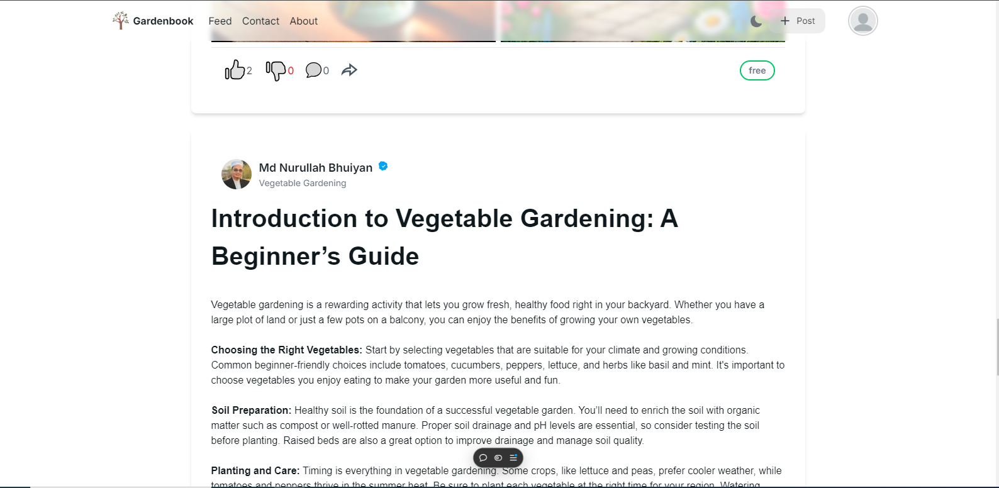

# Gardenbook Client



### **Project Overview**

The **Gardenbook** is a comprehensive full-stack web application designed for gardening enthusiasts and professionals to share, discover, and engage with gardening knowledge. It will provide users with insightful tips, plant care advice, seasonal guides, and techniques to enhance their gardening experiences. Additionally, users can share their gardening knowledge, interact with others, and explore premium content through a seamless payment integration.

The platform aims to foster a vibrant community where users can post gardening advice, upvote content, comment, follow other users, and share their experiences. Key features **rich text editor** for content creation, **user authentication**, **premium content access via payments**, and **social interaction tools**. It will blend informative gardening content with an interactive community-focused experience.

---

### **Core Project Objectives**

1. **Full-stack web application** using Next.js, Typescript, MongoDB, Express,, Node.js.
2. **JWT-based user authentication**, ensuring secure login, registration, and profile management.
3. **Responsive user interface** that works across devices—mobile, and desktop, implemented infinity scroll for better UX.
4. **Social features**, including upvoting posts, commenting, following other users, and displaying the most popular content.
5. **Rich text editor** to allow users to create, edit, and share gardening tips and guides, supporting multimedia content (images, videos, etc.).
6. **Payment Integration**: Integrate payment gateways like **AAMARPAY or Stripe** to access premium gardening contents.
7. **Advanced Search and Filter:** Implement search and filtering features that allow users to find relevant gardening content based on category, popularity, and other parameters.
8. **Admin dashboard** for managing users, posts, payments, and community moderation.

#### Pages:

- **Login/Registration Page:** Forms for user sign-up and login with secure authentication.
- **User Profile:** A personalized dashboard displaying user-specific content, and followed users and followers.
- **Admin Dashboard:** A control panel for administrators to manage content, users, and payment history, with graphs for monthly payments, posts, and user activity
- **Profile Page:** A section for users and admins to view and edit their profiles, including a display of their posts, followers, and followed users.
- **News-feed:** A page listing all gardening posts, with filtering options by category and other relevant properties.
- **About Us Page:** Information about the team or organization behind the project, outlining the mission and vision.
- **Contact Us Page:** A contact form or details for user inquiries and support.
- **Image gallery Section:** Add an image gallery section to showcase recent gardening images.

### **API endpoints**

> ### Auth
>
> - /signup
> - /login
> - /change-password

> ### User
>
> - profile/:userId
> - admin/dashboard
> - admin/dashboard/manage-users
> - admin/dashboard/manage-content
> - admin/dashboard/analytics

> ### Posts
>
> - /
> - /post/:postId

This is a template for creating applications using Next.js 14 (app directory) and NextUI (v2).

[Try it on CodeSandbox](https://githubbox.com/nextui-org/next-app-template)

## Technologies Used

- [Next.js 14](https://nextjs.org/docs/getting-started)
- [NextUI v2](https://nextui.org/)
- [Tailwind CSS](https://tailwindcss.com/)
- [Tailwind Variants](https://tailwind-variants.org)
- [TypeScript](https://www.typescriptlang.org/)
- [Framer Motion](https://www.framer.com/motion/)
- [next-themes](https://github.com/pacocoursey/next-themes)

## Local installation guideline

To run this project on your local machine. clone the repository and install dependency and env variables with your MongoDB database url. Then run the project. You will find env variable samples in .env.example file.

### Install dependencies

You can use one of them `npm`, `yarn`, `pnpm`, `bun`, Example using `npm`:

```bash
npm install
```

### Run the development server

```bash
npm run dev
```

Then it will run on your localhost 5000 port.

> - Here is the Live link of backend [Link](https://gardenbook-server.vercel.app)
> - Here is the Live link of backend-code [Link](https://github.com/nurullah91/gardenbook-server)
> - Here is an explanation of frontend video [Link](https://drive.google.com/file/d/1I5kKOzEZyiRUMcxBxlrDMVn0W3SR14Hg/view?usp=drive_link)

## Live link of the Server: https://gardenbook-client.vercel.app
